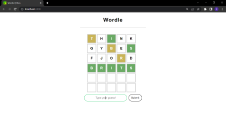

# Wordle-Using-Python-and-React
Wordle is a game wherein the player has to guess a 5-lettered word within 6 tries. The game includes certain hints for the players that aid in the guessing process. This is the final version of the previously built crude application. Developed using Python's `Flask` & `React`. 

## Libraries Used
This project makes use of the `Random` module of python for selecting a random word, `Flask` as the backend and `React` which is an open-source frontend JavaScript library.

## The Website 🌐
The Website is created using React along with HTML, CSS and JavaScript. The website showcases the main UI of the Wordle Game. The backend is a simple Flask app with a few routes as follows:

### 1) The Home route ("/") 🏠
This is the homepage of the Flask app that just returns a simple h1 saying "hello".

```Python
@app.get("/")
def home():
    return("<h1>hello<h1/>")
```

### 2) The NewWord route ("/newWord") 🆕
The NewWord route is the route where the game first requests for a word to be guessed by the player. This word is generated using the `newWord()` function of the wordle.py file which is the actual brain of the game. The word is then returned.
```Python
@app.post("/newWord")
def NewWord():
    response = newWord()
    message = {"answer": response}
    print(message)
    return jsonify(message)
```

### 3) The Check route ("/check") 🔍
The check route is the pathway that carries the input from the player and deciphers the information from the JSON object. 'text' is the input from the player and 'answer' is the answer is the word to be guessed. This answer and player input is then sent into the `CheckWord()` function of wordle.py file which returns a Python dictionary of the list of letters that are either correctly placed or are in the word but wrongly placed. It is then returned as a JSON Object.
```Python
@app.post("/check")
def check():
    text = request.get_json().get("text")
    answer = request.get_json().get("answer")
    print("text is",text,"answer is", answer)
    output = CheckWord(answer, text)
    print("output is",output)
    message = {"answer": answer, "output" : output}
    return jsonify(message)
```

## The Brain of the game 🧠
The Wordle.py file is the file that has all the required algorithms and rules of the game. It is used along with the main.py file that houses the backend for the project. The Wordle.py file is called from the main.py file to get appropriate responses to the user's inputs.

## Getting a new word ✨
The function `newWord()` picks up a random word from the list of a 3000+  and returns a string value.
```Python
def newWord():
    target = str(dict[random.randint(0, len(dict)-1)]).lower()
    return target
```

## Checking the Player input ✅
The player's guess has to compared with the original word to know how close the player is to guessing the correct word. This is done by the `CheckWord()` function. It receives two parameters namely the current word and the guess. If the word entered is not a legit 5-letter word, the function returns with a JSON Object in name-value pair to try again. If the word entered is a legit 5-letter word, the guess word is checked with a series of 1-line for statements and a JSON object consisting of 2 name-value pairs Wrong and Correct which consist of a list are returned.
```Python
def CheckWord(target, guess):
    if guess not in dict:
        return {"error":"Try again"}
    else:
        letters = list(guess)
        print("letters", letters)
        for i in letters:
            target_list = list(target)
            if(letters == target_list):
                return {"Wrong": list(set(set(x for x in list(o for o,v in enumerate(letters) if v == target_list[o])).symmetric_difference(set([letters.index(x) for x in letters if x in target_list])))),
                        "Correct":  list(x for x in [o for o, v in enumerate(letters) if v == target_list[o]])}
            return {"Wrong": list(set(set(x for x in list(o for o,v in enumerate(letters) if v == target_list[o])).symmetric_difference(set([letters.index(x) for x in letters if x in target_list])))),
                    "Correct":  list(x for x in [o for o, v in enumerate(letters) if v == target_list[o]])}
```
## Snaps of the Project 📸
<p align=center>
  
  <p align=center>Realtime Gameplay</p>
</p>